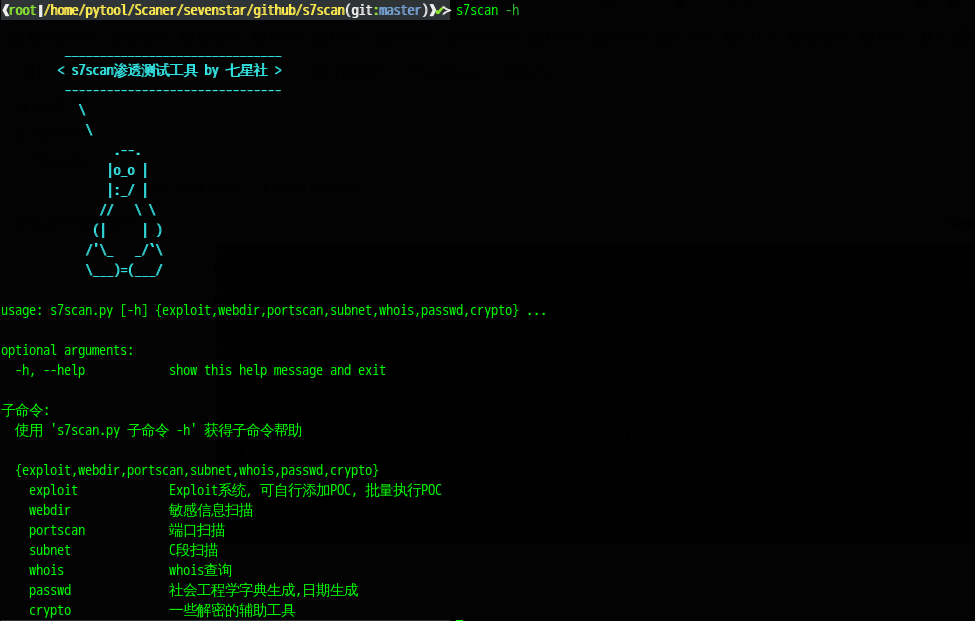

# s7scan


### 安装依赖

    pip install -r requirements.txt 

初次运行如果没有安装nmap库的话会报错，　这时不要使用`pip install nmap` 这样的命令来安装, pip 安装的是nmap-0.0.1版本，正确的安装为`apt-get install python-nmap`, 按照的版本为nmap-0.6.1

### Usage
```
usage: s7scan.py [-h] {exploit,webdir,portscan,subnet,whois,crypto} ...

optional arguments:
  -h, --help            show this help message and exit

子命令:
  使用 's7star.py 子命令 -h' 获得子命令帮助

  {exploit,webdir,portscan,subnet,whois,crypto}
    exploit             Exploit系统，可自行添加POC, 批量执行exp
    webdir              敏感信息扫描
    portscan            端口扫描
    subnet              C段扫描
    whois               whois查询
    crypto              一些解密的辅助工具

```


### 各个功能

#### exploit 

```
usage: python s7scan.py [-h] {exploit,webdir,portscan} ... exploit
       [-h] [-s S] [-u U] [-f F] [-m M] [-l] [-q Q] [-o O]

example: python s7scan.py exploit -s test -m 127.0.0.1/30

optional arguments:
  -h, --help  show this help message and exit
  -s S        加载POC, 提供test测试poc
  -u U        target url: 目标url
  -f F        target file: 目标url文件
  -m M        target mask: 目标网段,默认掩码为24
  -l, --list  列举所有的poc
  -q Q        关键字搜索poc
  -o O        导出json格式文件
```

#### webdir 
```
usage: python s7scan.py [-h] {exploit,webdir,portscan} ... webdir
       [-h] [-u U] [-o O]

example:python s7scan.py webdir -u localhost

optional arguments:
  -h, --help  show this help message and exit
  -u U        target url:目标url
  -o O        导出json格式文件
```


#### portscan 
```
usage: python s7scan.py [-h] {exploit,webdir,portscan} ... portscan
       [-h] [-t T] [-m M] [-p P] [-o O]

example:python s7scan.py portscan -t localhost

optional arguments:
  -h, --help  show this help message and exit
  -t T        target ip 目标ip
  -m M        mask(127.0.0.1/28 默认掩码为24)
  -p P        port 目标端口
  -o O        导出json格式文件
```

#### subnet
```
usage: s7scan.py subnet [-h] [-t T]

example:python s7scan.py subnet -t 211.82.99.1

optional arguments:
  -h, --help  show this help message and exit
  -t T        target ip 目标ip

```

#### whois

```
usage: s7scan.py whois [-h] [-t T]

example:python s7scan.py whois -t blogsir.com.cn

optional arguments:
  -h, --help  show this help message and exit
  -t T        target domain
```

#### crypto

```
usage: s7scan.py crypto [-h] [-k KAISA] [-k2 KAISA2] [-m MORSE] [-zl ZHALAN]
                        [-nb NBASE64] [-b2s B2S] [-a2s A2S] [-h2s H2S]

example:python s7scan.py crypto -t blogsir.com.cn

optional arguments:
  -h, --help            show this help message and exit
  -k KAISA, --kaisa KAISA
                        凯撒解密,只偏移英文大小写字母
  -k2 KAISA2, --kaisa2 KAISA2
                        凯撒移位,偏移整个ascii
  -m MORSE, --morse MORSE
                        摩斯解密
  -zl ZHALAN, --zhalan ZHALAN
                        栅栏解密
  -nb NBASE64, --nbase64 NBASE64
                        自动识别多重base64解密
  -b2s B2S              二进制转字符串,八位，七位分别解密
  -a2s A2S              ascii转字符串,用空格或者逗号分隔
  -h2s H2S              十六进制转字符串

```

